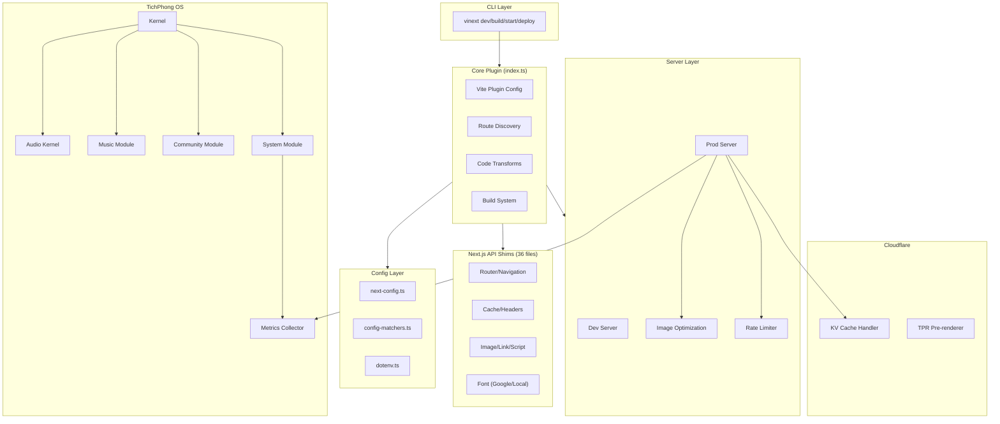
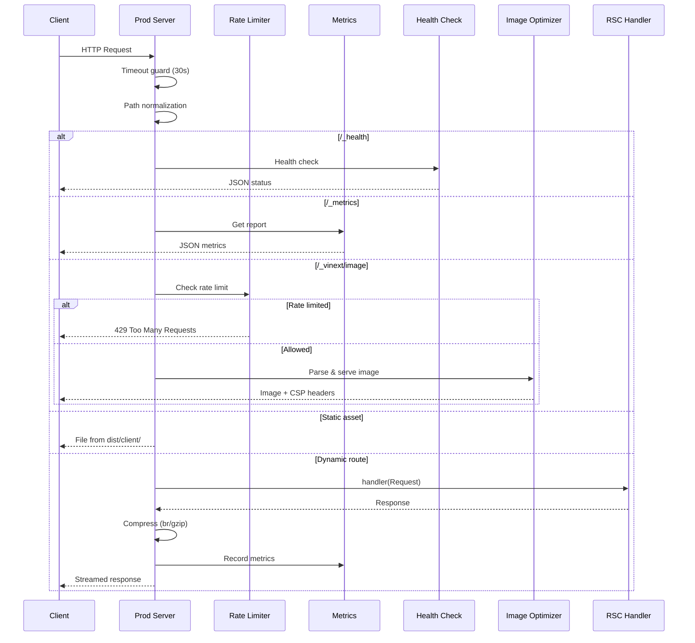

# Vinext-Clone Architecture

## Tổng Quan Kiến Trúc

## Module Overview

| Module | Files | Lines | Description |
|--------|-------|-------|-------------|
| **Core Plugin** | `index.ts` | 3,697 | Vite plugin, route discovery, build config |
| **Server** | 16 files | ~4,500 | Production/dev servers, image optimization, rate limiting |
| **Shims** | 36 files | ~5,000 | Next.js API compatibility layer |
| **Config** | 3 files | ~1,300 | Config resolution, matchers, env loading |
| **TichPhong OS** | 112 files | ~6,000 | Kernel, audio, music, community, system |
| **Cloudflare** | 3 files | ~1,400 | KV cache, TPR pre-renderer |
| **Routing** | 2 files | ~1,500 | App Router + Pages Router discovery |
| **Utils** | 4 files | ~300 | Logger, hash, query, project helpers |

## Request Flow

## Test Coverage

| Test File | Tests | Module |
|-----------|-------|--------|
| `image-optimization.test.ts` | 26 | Image pipeline |
| `deploy.test.ts` | 12 | Deploy & config generation |
| `prod-server-utils.test.ts` | 11 | Server utilities |
| `navigation.test.ts` | 8 | Navigation context |
| `metrics.test.ts` | 8 | Metrics collector |
| `rate-limit.test.ts` | 7 | Rate limiter |
| `cache.test.ts` | 6 | Memory cache handler |
| `logger.test.ts` | 6 | Structured logger |
| `normalize-path.test.ts` | 5 | Path normalization |
| `router.test.ts` | 6 | Router utilities |
| `config-matchers.test.ts` | 3 | Config pattern matching |
| `kernel.test.ts` | 3 | TichPhong OS kernel |
| **Total** | **101** | |

## Environment Variables

| Variable | Default | Description |
|----------|---------|-------------|
| `PORT` | `3000` | Server port |
| `VINEXT_REQUEST_TIMEOUT` | `30000` | Request timeout (ms) |
| `VINEXT_IMAGE_RATE_LIMIT` | `100` | Max image requests per window |
| `VINEXT_IMAGE_RATE_WINDOW` | `60` | Rate limit window (seconds) |
| `VINEXT_LOG_LEVEL` | `info` (prod) / `debug` (dev) | Log level |
| `VINEXT_TRUSTED_HOSTS` | — | Comma-separated trusted proxy hosts |
| `VINEXT_TRUST_PROXY` | `0` | Trust X-Forwarded-Proto |
